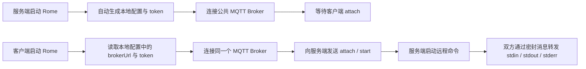

# Rome

基于公网 MQTT 中转并支持后续直连的远程命令行桥接工具。

Rome 的目标很直接：一台机器作为服务端等待连接，另一台机器作为客户端接入，然后在公网环境下远程控制 `Claude Code`、普通 shell 或 `cmd.exe`。当前版本使用 EMQX 公共 MQTT Broker 做首次发现与回退链路，并支持后续优先直连。MQTT 与直连 WebSocket 数据面都使用端到端密封。默认情况下，服务端还会自动拉起 Cloudflare Quick Tunnel，把本地 `ws://127.0.0.1:31731` 映射成公网 `wss://...`。

## 工作流程



## 特性

- 不需要自建中转服务器
- 首次运行自动生成本地配置
- MQTT 与直连消息都做端到端密封，公网中间层无法直接读明文
- 基于 `node-pty`，支持交互式终端
- Windows 默认使用 `cmd.exe`
- 服务端默认在启动时所在目录执行远程命令
- 服务端默认自动拉起 Cloudflare Quick Tunnel
- 首次可走 MQTT，后续优先使用已保存的直连地址

## 安全模型

- 任何知道共享 `token` 的人，都拥有完整远程控制权限
- 消息内容在进入公共 Broker 或直连 WebSocket 前都会被密封
- 仓库不会提交真实配置；`rome.config.json` 只在本地生成，并已加入 git 忽略

因此必须使用强随机 `token`，并只分享给可信对象。

## 快速开始

### 1. 安装依赖

```bash
npm install
```

### 2. 在服务端机器启动

Windows：

```bat
start-server.bat
```

Linux/macOS：

```bash
./start-server.sh
```

首次启动时，Rome 会自动生成本地 `rome.config.json`，并写入随机 `token`。

服务端启动后会一直等待客户端连接，不会主动发起会话。

### 3. 把配置同步给客户端机器

只需要同步下面的 `token` 即可：

- `token`

客户端默认会使用同一个公开 MQTT Broker。
如果你没有提前准备客户端配置，直接运行后输入服务端显示的 `token` 也可以。

可以先从 `rome.config.json.example` 复制一份模板。

### 4. 在客户端机器启动

Windows：

```bat
start-client.bat
```

Linux/macOS：

```bash
./start-client.sh
```

首次运行时，客户端会提示输入服务端显示的 `token`，随后自动保存并立即连接。
客户端会先尝试本地保存的 `directUrl`。
如果直连失败，会自动回退到 MQTT。
一旦服务端通过状态消息下发新的 `channelName` 或 `directUrl`，客户端会自动更新本地配置。

## 命令行用法

服务端：

```bash
node bin/rome.js serve
```

客户端：

```bash
node bin/rome.js connect
```

配对并连接：

```bash
node bin/rome.js pair
```

### 服务端常用参数

- `--broker <url>`：覆盖 MQTT Broker 地址
- `--direct-port <port>`：本地直连 WebSocket 监听端口
- `--public-direct-url <url>`：服务端对外通告的直连地址，可填写公网域名或 `wss://` 地址
- `--cloudflared-path <path>`：指定本机已有 `cloudflared` 可执行文件
- `--no-auto-tunnel`：禁用自动 Cloudflare Quick Tunnel
- `--shell <cmd>`：设置默认远程命令
- `--args <args...>`：设置默认命令参数
- `--dir <path>`：设置远程命令工作目录
- `--token <token>`：覆盖共享 token
- `--keep`：会话结束后保持服务端继续运行

### 客户端常用参数

- `--broker <url>`：覆盖 MQTT Broker 地址
- `--cmd <cmd>`：指定远程启动命令
- `--args <args...>`：指定远程命令参数
- `--token <token>`：覆盖共享 token
- `pair`：首次配对推荐使用，会在需要时提示输入 token 并保存到本地配置

## 配置文件

本地配置示例：

```json
{
  "brokerUrl": "mqtts://broker.emqx.io:8883",
  "token": "replace-with-a-random-32-plus-char-token",
  "channelName": "你的服务器名称",
  "directUrl": "wss://rome.example.com/ws",
  "client": {
    "cmd": "cmd.exe",
    "args": []
  },
  "server": {
    "shell": "cmd.exe",
    "args": [],
    "workDir": "",
    "publicDirectUrl": "",
    "autoTunnel": true,
    "cloudflaredPath": ""
  }
}
```

说明：

- 如果 `server.workDir` 为空，Rome 会使用服务端启动时的当前目录
- `directUrl` 是客户端上次成功拿到的服务端直连地址，后续会优先尝试
- `server.publicDirectUrl` 用于服务端固定通告公网可达地址；如果留空，Rome 会优先尝试自动 Quick Tunnel
- `server.autoTunnel` 默认是 `true`，服务端会自动拉起 Cloudflare Quick Tunnel
- `server.cloudflaredPath` 可指定本机已有 `cloudflared` 路径；不填时会先尝试 PATH，再自动下载
- 如果 `rome.config.json` 不存在，或其中的 `token` 太弱，Rome 会自动重新生成本地配置

## 公网与零信任部署

- 默认模式下，Rome 会自动启动 Cloudflare Quick Tunnel，并把返回的 `https://...trycloudflare.com` 转成客户端可用的 `wss://...`
- 如果本机没有 `cloudflared`，Rome 会自动下载到本地工具目录后再启动
- 当 `server.publicDirectUrl` 是 `wss://...` 时，客户端会直接按该地址连接，并跳过自动 Tunnel
- 即使入口层已经提供 TLS，Rome 仍会对直连帧再次做端到端密封，减少中间层可见性

## 开发

```bash
npm run build
npm test
```

## 中转

默认 Broker：

- `mqtts://broker.emqx.io:8883`

参考：

- [EMQX Public MQTT Broker](https://www.emqx.com/en/mqtt/public-mqtt5-broker)

## 许可证

MIT
